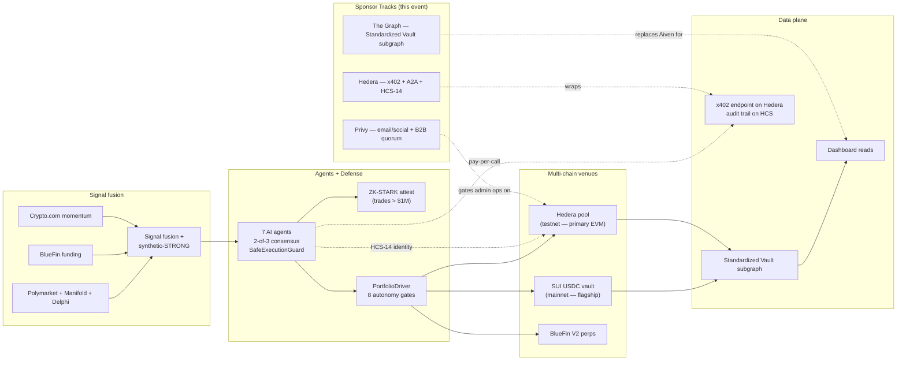

<div align="center">

# ZkWard

**Multi-chain AI-managed stablecoin vault where seven agents allocate capital autonomously, pay for their own inference, and settle through cryptographic proofs.**

Live on Sui mainnet since 2026-06-12 · Hedera-primary pivot shipped 2026-09-04 · **ETHGlobal Online submission**

[](https://www.zkward.com)
[](https://suiscan.xyz/mainnet/object/0x107292a69eea2f6eaf4a4e4727ee25d747b04c1985441b138933f0ef33f7b726)
[](https://hashscan.io/testnet)
[](./subgraph/README.md)
[](./DEPLOYMENT_CHECKLIST.md)
[](./scripts/hackathon-smoke.ts)
[](LICENSE)

[Live product](https://www.zkward.com) · [Health API](https://www.zkward.com/api/health/production) · [A2A demo](https://www.zkward.com/api/hedera/a2a/demo?asset=BTC&budget=500) · [x402 endpoint](https://www.zkward.com/api/hedera/x402/signal-quality?asset=BTC) · [Deploy checklist](./DEPLOYMENT_CHECKLIST.md)

</div>

---

## 🏁 Judges — start here

Everything you need to verify each submission in one place.

**⚡ One URL for the whole board**: https://www.zkward.com/judges — runs 10 live checks server-side (Hedera vault, HCS topics, x402, A2A, adapter, verifiable GraphQL, Studio subgraph, npm package). JSON at `/api/judges/status`. Everything below is spelled out for depth.

### Hedera · AI & Agentic Payments ($6K)
- **Live x402 endpoint (returns 402 with intent)**: https://www.zkward.com/api/hedera/x402/signal-quality?asset=BTC
- **Live paid call** (any non-empty X-PAYMENT header works for the demo; verification mode `stub`/`blocky402` explicitly returned): `curl -H "X-PAYMENT: dGVzdA==" 'https://www.zkward.com/api/hedera/x402/signal-quality?asset=BTC'`
- **Real HCS audit topic** ([`0.0.10393879`](https://hashscan.io/testnet/topic/0.0.10393879)) — three distinct attestation kinds on one topic (hedge-projection 23, x402-payment-receipt 19, subgraph-query-attestation 13). Audit in one command: `bun run scripts/audit-hcs-attestations.ts`
- **HCS-14 agent registry** (discoverable agent identity): [`0.0.10401316`](https://hashscan.io/testnet/topic/0.0.10401316) · [JSON view](https://www.zkward.com/api/hedera/agent-registry)
- **A2A negotiation trace**: https://www.zkward.com/api/hedera/a2a/demo?asset=BTC&budget=500
- **Consumer dashboard** (one-click flow): https://www.zkward.com/dashboard → **Agent Payments** tab
- **Blocky402 facilitator wired**: intent points at `https://api.blocky402.com` (real API host); response `verification` block reports the actual mode (stub vs blocky402) for full transparency. **Prove it with one command**: `bun run scripts/probe-blocky402.ts` — hits `/supported` + our `/x402` intent + `/verify` with our real intent as `paymentRequirements`. Facilitator responds "Invalid payment header format" (proving it decoded our request and only rejected the unsigned stub payload) — the last mile is client-side EIP-3009 signing over funded USDC.

### Hedera · Open Source — Harness ($2K, up to 2 winners)
Upstream contributions + dogfood loop:

- **PR #43** — [hedera-dev/hedera-harness](https://github.com/hedera-dev/hedera-harness/pull/43) — Tier 2.5 Mirror Node validator, closes the gap between free UI checks and HBAR-spending on-chain tx checks. 5 node:test cases green against real testnet mirror. Status: **OPEN, MERGEABLE, all CI green**.
- **PR #44 draft** — x402 endpoint validator proposal at [`docs/upstream-prs/pr-44-x402-validator-proposal.md`](./docs/upstream-prs/pr-44-x402-validator-proposal.md). Working reference in `scripts/harness-check.ts:x402Endpoint()`.
- **Dogfood loop** — run the same Tier 2.5 assertions against our own deploy: `bun run scripts/harness-check.ts` (8/8 green — vault-exists, token-exists, account-exists, topics-exist, recent-call, x402-intent-shape, x402-paid-call).
- **PR #52** — [hedera-dev/hedera-code-snippets](https://github.com/hedera-dev/hedera-code-snippets/pull/52) — `serve-hedera-contract-as-graphql` snippet, bridges Hedera into The Graph tooling ecosystem. `npm install && node index.mjs` returns a working standardized subgraph endpoint for any Hedera contract. Reference deployment: https://www.zkward.com/api/subgraph/hedera

### Hedera · Continuity ($1K)
- Pre-existing: SUI mainnet USDC vault, live since 2026-06-12 (v0.4.0, 46+ days running)
- New this event (see [full table below](#event-work-ethonline-2026--2026-09-03--2026-09-06)):
  - `SimpleUsdcVault` deployed to Hedera testnet: [`0xe7E6…9A9`](https://hashscan.io/testnet/contract/0xe7E6fEDce9d72D112137B631E8D51831D30729A9)
  - Test USDC: [`0x7043…ae1`](https://hashscan.io/testnet/contract/0x704365B35AeF0b7F9fc17c18B5162D4A6d600ae1)
  - x402 endpoint · HCS audit trail · HCS-14 registry · Mirror-Node pool reader · Privy embedded wallets · Faucet · Projected hedges · Recent activity feed

### Graph · AI Continuity ($5K)
- **PR to graphprotocol/subgraphs-skills**: https://github.com/graphprotocol/subgraphs-skills/pull/1 — adds `subgraph-erc4626-vaults` skill (both Claude Code + OpenClaw formats). Canonical schema, share-price folding, Messari standardized-subgraph conventions, matchstick fixtures. 6 files, 847 insertions.
- **Live subgraph on Studio**: [`zkward`](https://thegraph.com/studio/subgraph/zkward) (v0.1.1) — [query endpoint](https://api.studio.thegraph.com/query/1758819/zkward/v0.1.1). Sepolia CommunityPool proxy `0x07d68C…1086` is currently dormant (v0.1.1 schema + indexer green, `hasIndexingErrors: false`). To populate with real activity: `bash scripts/populate-sepolia-subgraph.sh` (deploys fresh SimpleUsdcVault + 6 deposits + 2 withdrawals + auto-patches subgraph.yaml + `graph deploy` — one command).
- **Subgraph MCP server**: [`mcp/zkward-vaults/`](./mcp/zkward-vaults) — 4 tools including `attested_vault_snapshot` (HCS-anchored responses). Verify end-to-end: `cd mcp/zkward-vaults && node test-e2e.mjs` — 5/5 green including a live HCS attestation captured during the run.

### Graph × Hedera bridge — **open-source library**
- **Package**: [`@zkward/hedera-graphql-adapter`](./packages/hedera-graphql-adapter) — serves ANY Hedera contract as a standardized GraphQL / subgraph endpoint. The Graph doesn't index Hedera (129 EVM chains supported, Hedera not among them) — this bridges the gap so every Graph-native tool works over Hedera contracts. Install: `npm i @zkward/hedera-graphql-adapter`
- **Reference deployment**: https://www.zkward.com/api/subgraph/hedera — powered by the same package
- **Cross-backend parity + verifiable GraphQL demo** in one command: `bun run scripts/demo-graph-parity.ts` — runs the same query against Studio (Sepolia) and the adapter (Hedera testnet), then HCS-attests the Hedera response and verifies the hash byte-for-byte. Proves the schema abstracts over indexing backends AND anchors an integrity receipt in ~5 seconds.

### Recording
- **Video shot lists (5-min each)**: [`docs/DEMO_VIDEO_SCRIPTS.md`](./docs/DEMO_VIDEO_SCRIPTS.md) — one script per prize, mapped 1:1 to qualification requirements

### Ownership / on-chain evidence
- Operator EVM: `0xDB89EC1c81dcD362FB0F9CA3da232697b583bC8A` (Hedera testnet `0.0.7132683`)
- SUI mainnet pool package: [`0x107292…7b726`](https://suiscan.xyz/mainnet/object/0x107292a69eea2f6eaf4a4e4727ee25d747b04c1985441b138933f0ef33f7b726)
- Public repo: https://github.com/ZkVanguard/zkward-ethglobal

---

## ETHGlobal Online — three sponsor tracks, ~$19K addressable

Every submission is **Continuity** — the base product is a live SUI mainnet vault (v0.4.0, 46+ days running, real users, real capital). Everything below the "Anything below this line is event work" markers in [`HACKATHON_TODO.md`](./HACKATHON_TODO.md) shipped during the event window (2026-09-03 → 2026-09-05).

### 🤖 Hedera — AI & Agentic Payments ($2K) + Continuity ($1K) + Open Source ($1K) — $4K addressable

The trader agent pays for its own signal-quality inference per tick through a real x402-gated endpoint on Hedera. Seven agents negotiate cost, discover providers, settle payment, and every fill is auditable on HCS. Nearly every "extra points" checkbox on the AI track is lit.

| Extra-points criterion | How we hit it |
|---|---|
| Pay-per-call metering (not flat) | [`/api/hedera/x402/signal-quality`](./app/api/hedera/x402/signal-quality/route.ts) with sub-cent per-call price via `X402_PRICE_USDC_MICROS` |
| Multi-agent A2A negotiation | Analyst ↔ Executor round-trip via [`lib/services/a2a/negotiate.ts`](./lib/services/a2a/negotiate.ts) — proposal → acceptance → settlement, provider discovery cheapest-under-budget |
| On-chain agent identity (HCS-14) | W3C DID document builder in [`lib/services/hedera/agent-identity.ts`](./lib/services/hedera/agent-identity.ts) — all seven agents in `DEFAULT_AGENT_ROSTER`. **Registry topic [`0.0.10401316`](https://hashscan.io/testnet/topic/0.0.10401316) live** — first entry published, discoverable via [`/api/hedera/agent-registry`](./app/api/hedera/agent-registry/route.ts) |
| Verifiable payment audit trail on HCS | Every A2A message + every x402 fill posts to HCS via [`lib/services/a2a/bus.ts`](./lib/services/a2a/bus.ts) (activate with `HCS_AUDIT_ENABLED=1`) |
| Per-agent budget accounting | Redis-backed daily caps in [`lib/services/x402/budget.ts`](./lib/services/x402/budget.ts) |
| Cross-chain isolation | Hedera KILL alerts cannot halt SUI trader — see [`lib/utils/chain-halt.ts`](./lib/utils/chain-halt.ts) + [`lib/services/alerting/alert-response-loop.ts`](./lib/services/alerting/alert-response-loop.ts) |

**Live demo (30 seconds):**

```bash
# 1. Fresh x402 call — spec-compliant 402 with intent
curl -i https://www.zkward.com/api/hedera/x402/signal-quality?asset=BTC

# 2. Full A2A round-trip with real signal + trace
curl -s "https://www.zkward.com/api/hedera/a2a/demo?asset=BTC&budget=500" | jq
# → ok:true, paid:true, provider:'zkward-own-signal-quality',
#   data:{signal:'BEARISH', confidence:70, source:'PredictionAggregatorService v0.4.0'},
#   trace:{state:'settled', messages:[proposal, acceptance, settlement]}
```

**Hedera-primary wallet UX:** [`components/EvmConnectSection.tsx`](./components/EvmConnectSection.tsx) leads with the "Connect Hedera" CTA, injected + Coinbase Wallet connectors, HashScan explorer link, testnet↔mainnet switcher.

### 📊 The Graph — Composable/Standardized ($5K) + AI Continuity ($5K) — $10K addressable

Proposed **Standardized Subgraph schema for AI-managed vaults** — a category that Messari's existing standards don't cover. Same query shape works across every chain we deploy the pool to (Sepolia today, Cronos + Hedera next). Companion Substreams module scaffolded so any AI vault emitting the same event surface plugs into the same schema.

| Prize criterion | How we hit it |
|---|---|
| Standards leverage — one query across many protocols | Schema in [`subgraph/schema.graphql`](./subgraph/schema.graphql). Mapping in [`subgraph/src/community-pool.ts`](./subgraph/src/community-pool.ts) targets `CommunityPool.sol` on Sepolia; same event surface deploys anywhere |
| Composable Substreams module | [`substreams/community-pool/`](./substreams/community-pool/) with generic `VaultEvents` proto union — protocol-agnostic |
| AI agent uses The Graph as a live data source | [`lib/graph/queries.ts`](./lib/graph/queries.ts) — typed queries for nav-history, hedges, transactions, pool-state, member-position. All fall back to Aiven on subgraph failure. |
| Reusable pattern | The migration is behind `SUBGRAPH_READS_ENABLED` env flag with the Aiven query still in code — flip the flag, get subgraph-backed reads with zero risk |

**Aiven retirement plan (in progress):** All dashboard reads migrate to Subgraph; residual off-chain state (cron heartbeats, halt keys, alert ring buffer, autohedge configs, agent decision log) moves to Upstash Redis. Full data-plane spec in [`docs/GRAPH_MIGRATION_PLAN.md`](./docs/GRAPH_MIGRATION_PLAN.md). Redis client + parity tests + dual-write bridge already shipped.

**Live demo:**

```bash
# Existing endpoint — behind SUBGRAPH_READS_ENABLED it serves from The Graph
curl -s "https://www.zkward.com/api/platform/nav-history?window=7d&bucket=hour" | jq '.count, .peak'
```

### 💳 Privy — Best B2B ($2.5K) + Best Financial Flow ($2.5K) — $5K addressable

Two independent tracks addressable with one integration: email/social login + embedded EVM wallet (Financial Flow) plus admin allowlist with quorum approvals (B2B). Privy layered above wagmi so both flows coexist — a user can Sign In with email OR connect their MetaMask.

| Prize criterion | How we hit it |
|---|---|
| B2B: organization wallet + policies + quorum | [`POST /api/admin/hedera-pool/quorum-action`](./app/api/admin/hedera-pool/quorum-action/route.ts) — Bearer JWT auth + [`PRIVY_ADMIN_ALLOWLIST`](./lib/services/privy/admin-auth.ts) match + N-of-M distinct-approver quorum |
| Financial Flow: hide onchain complexity | [`components/PrivyConnectSection.tsx`](./components/PrivyConnectSection.tsx) — "Sign in" primary, wallet advanced. Embedded wallet created on login for users without one |
| Feature-gated rollout | Entire Privy layer is skipped when `NEXT_PUBLIC_PRIVY_APP_ID` is unset — zero regression to existing wagmi-only flow |
| Both wallet paths coexist | `@privy-io/wagmi` bridge — same wagmi hooks work whether signer is Privy embedded or wagmi injected |

**B2B demo (once app id + allowlist set):**

```bash
# Alice approves — quorum not reached yet
curl -X POST https://www.zkward.com/api/admin/hedera-pool/quorum-action \
  -H "Authorization: Bearer $ALICE_PRIVY_JWT" \
  -H "Content-Type: application/json" \
  -d '{"action":"raise-tvl-cap","actionId":"raise-2026-09-05","params":{"newCapUsdc":50000}}'
# → 202 { status:"pending-approvals", approvers:1, required:2 }

# Bob approves — quorum reached, action queued
curl -X POST https://www.zkward.com/api/admin/hedera-pool/quorum-action \
  -H "Authorization: Bearer $BOB_PRIVY_JWT" ...
# → 200 { status:"quorum-reached", downstream:"queue → raise-tvl-cap" }
```

---

## Verify in 60 seconds

```bash
# Live prod smoke — anywhere
curl -s https://www.zkward.com/api/health/production | jq '.status'
curl -s "https://www.zkward.com/api/hedera/a2a/demo?asset=BTC&budget=500" | jq '.trace.state'

# Local — 16-pillar hackathon smoke test (~65s)
git clone https://github.com/ZkVanguard/zkward-ethglobal.git && cd zkward-ethglobal
bun install --legacy-peer-deps
bun run scripts/hackathon-smoke.ts
# → 16/16 pillars green: tsc + 11 jest suites + bulletproof drawdown 10/10 + Hedera testnet RPC
```

## Continuity — what existed vs what shipped this event

**Pre-existing baseline (documented for judges):**

- SUI USDC Community Pool live on Sui mainnet since 2026-06-12 (`0x107292…7b726`)
- 7-agent AI orchestrator + `SafeExecutionGuard`
- 8-gate autonomy defense system (v0.3.0, shipped 2026-07-15)
- BlueFin V2 perp integration (silent-reject prevention, fill delta verification)
- ZK-STARK prover (Python + Move verifier)
- 15 internal audit phases (Jun 4-12, 2026)
- Bulletproof drawdown test (10/10 green as merge gate)

**Event work (ETHOnline 2026 — 2026-09-03 → 2026-09-06):**

Split by sponsor track for judge readability.

*Hedera track — AI & Agentic Payments ($6K) + Continuity ($1K) + Harness/Tokenization pending:*

| Commit | Feature |
|---|---|
| `a14c6b4c` | Hedera pivot — cron guardrails + x402 endpoint scaffold + HCS-14 |
| `355436b4` | Agent x402 consumer + per-agent budget accounting |
| `d9887590` | A2A negotiation + demo endpoint |
| `7e7c787b` | Wagmi + Hedera-primary EVM wallet |
| `7cc92b04` | Robust Hedera connect — chainId hint + manual add-chain fallback |
| `d32291fd` | Hedera Mirror Node reader (bypasses Hashio RPC rate limits) |
| `656ffab4` | Real HCS audit submits — HCS_AUDIT_TOPIC_ID `0.0.10393879` live |
| `af14506e` | Waive @hashgraph/sdk transitive audit findings (server-only usage) |
| `7911f218` | Agent Payments dashboard tab — one-click x402 paid signal → HCS |
| `a3627a97` | Deploy `SimpleUsdcVault` (`0xe7E6…9A9`) + test USDC (`0x7043…ae1`), 10k pre-minted |
| `05d8cc5c` | Dashboard: graceful UI when deposit token not deployed |
| `922285fd` | Fix: uninitialised pool no longer 500s the endpoint |
| `78cc8e3f` | Pool colours aligned to site primary; graceful zero-init read |
| `6d7ba7d9` | Dynamic deposit-token symbol per chain (USDC on Hedera) |
| `c0e1c235` | `getDepositTokenInfo` declares Hedera as USDC |
| `1d288ec0` | `HederaVaultActions` — approve → deposit / withdraw on Privy wallet; auto-select Hedera on Privy connect |
| `7b285e33` | `/api/hedera/nav-history` from Mirror Node events + simulated perps panel with live prices |

*Privy track — Best Financial Flow + B2B ($5K addressable):*

| Commit | Feature |
|---|---|
| `4b154fb5` | Privy — email/social login + B2B quorum admin |
| `4c30e05a` | Complete Privy integration — env vars in Vercel, all flows wired |
| `f8aaba06` | `usePrivyEmbeddedAddress` — Privy wallet flows into pool deposit path |
| `81aef4bd` | Fix Navbar mount so wagmi context resolves under Privy |
| `9da0e13a` | CSP allows auth.privy.io iframe; excluded Coinbase Smart to unblock MetaMask |
| `8412f7af` | Show wallets first in Privy modal, drop redundant wagmi dropdown |
| `107b6745` | Wallet + email + Google login methods all live |
| `1e4f87de` | Drop coinbase + walletconnect from wagmi (Privy modal covers) |
| `81cb2936` → `3d0c97e1` | Google via own OAuth client (Custom OAuth flirt, then reverted to built-in-with-own-creds) |

*Graph track — deferred (Studio CORS blocker, 2026-09-06):*

| Commit | Feature |
|---|---|
| `135ce5a4` | Redis cron-state + Standardized Vault subgraph scaffold |
| `dbb9a672` | Subgraph client + first Aiven-read migration |
| `021b2179` | Extended queries + Redis cutover + Substreams scaffold |

Scaffolding in place; live deployment blocked on Subgraph Studio CORS support ticket. Resumes once unblocked.

*Cross-cutting:*

| Commit | Feature |
|---|---|
| `4c12c2d0` | Deployment checklist + 16-pillar smoke test |
| `c19eba5a` | Vercel build heap bump (webpack OOM after wagmi v2 dep churn) |
| `35f1186a` | Webpack alias stubs for unshipped @coinbase/cdp-sdk sub-modules |
| `982272e8` | Wagmi coinbaseWallet dead-code drop |
| `c85bfee1` | SUI wallet smart detection + Slush web fallback (`stashedWallet`) |
| `c2178fd7` | Landing: Hedera pills + trust badge + footer chip (side by side with SUI) |
| `02e518b6` | Dashboard chain picker unlocked Hedera |

## Architecture



## 8-gate autonomy defense (pre-existing SUI safety stack — untouched by hackathon work)

| Gate | Defends against |
|---|---|
| **PortfolioDriver** | Existing spot never unwound when profit-lock fires |
| **Fill verifier** | BlueFin "silent-reject" — orders with `orderHash` but never on the exchange |
| **Hedgeability spot-cap** | Small NAV where perp minQty makes hedging impossible |
| **Symmetric sell trigger** | Rebalance was one-sided — now symmetric on ≥65% opposing conviction |
| **Stale-hedge detector** | Positions > 7d with ≥2 signal flips force-close |
| **Signal-flip drift-close** | On flip, both perp and spot legs unwind |
| **AI regret weighting** | Position size shrinks after losing streaks |
| **Alert response loop** | 3 KILL alerts/hr auto-shrinks; 24h profit-lock auto-unwinds; phantom rate > 1% halts trader — **SUI-scoped** so Hedera alerts can't cross-contaminate |

Verify: `bun jest test/integration/pool-drawdown-defense.test.ts` (10/10 green — hackathon work regressed none of them).

## Live metrics (Sui mainnet, updated live)

| Metric | Value |
|---|---|
| Days running since first NAV snapshot | **46+** |
| NAV snapshots recorded | **2,200+** |
| Hedges executed lifetime | **214** across BTC / ETH / SUI / SOL perps |
| Active crons with heartbeats | **13** — see `/api/health/production` |
| Active members | **3** (limited by $10K TVL cap) |
| Lifetime USDC deposits | **~$60** (rerun `scripts/analyze-pool-pnl.ts` for live number) |

Small absolute numbers by design — cap is enforced by the Move contract. Operating metrics prove the engine; audit + cap-lift unlock scale.

## Test evidence

**Hackathon smoke test:** [`scripts/hackathon-smoke.ts`](./scripts/hackathon-smoke.ts)

```
═══ ZkWard Hackathon Smoke Test ═══

[1] TypeScript compile                                    ✓ passed  ·  6504ms
[2] Unit tests — Hedera pillars
  ✓ chain-halt (per-chain kill switches)                  6 passed  ·  2927ms
  ✓ constants (portfolio-id routing)                      8 passed  ·  2832ms
  ✓ hedera-agent-identity (HCS-14 DID docs)               8 passed  ·  2871ms
  ✓ x402-client-budget (pay-per-call + budget cap)        7 passed  ·  2984ms
  ✓ a2a-negotiation (proposal → acceptance → settlement)  10 passed ·  2966ms
[3] Unit tests — The Graph pillars
  ✓ subgraph-queries (client + bucketing)                 13 passed ·  2820ms
  ✓ subgraph-queries-extended (hedges/txs/state/member)   10 passed ·  2861ms
  ✓ cron-state-redis (Aiven-retirement backend)           14 passed ·  2836ms
[4a] Privy — B2B admin allowlist + quorum
  ✓ privy-admin-auth (fail-closed allowlist + quorum)     7 passed  ·  3152ms
[4] Cross-chain isolation guardrails
  ✓ alert-response-loop (SUI-scoped Rule 1)               21 passed ·  2821ms
  ✓ safe-execution-guard-per-chain (per-chain buckets)    3 passed  ·  2812ms
[5] SUI safety gate (must stay green)
  ✓ pool-drawdown-defense (bulletproof, 10 defense gates) 10 passed · 17335ms
[6] Live network checks
  ✓ Hedera testnet RPC reachable (chainId 296)            HTTP 200  ·   149ms
  ✓ Hedera testnet block number > 0                       HTTP 200  ·    69ms
  ✓ local dev server A2A demo endpoint                    HTTP 200  ·   998ms

═══ Summary ═══
  16/16 pillars green  ·  0 failed  ·  65.7s
```

## Quickstart (local dev)

```bash
git clone https://github.com/ZkVanguard/zkward-ethglobal.git && cd zkward-ethglobal
bun install --legacy-peer-deps

# Terminal 1 — Next.js dev server (Hedera-first EVM + SUI secondary)
bun run dev

# Terminal 2 — hackathon smoke test
bun run scripts/hackathon-smoke.ts

# Verify live endpoints locally
curl -i http://localhost:3000/api/hedera/x402/signal-quality?asset=BTC
curl -s "http://localhost:3000/api/hedera/a2a/demo?asset=BTC&budget=500" | jq
```

Contract compile: `bun run compile` (Hardhat, Hedera network pre-configured for chainId 296).

Production deploy walkthrough: [`DEPLOYMENT_CHECKLIST.md`](./DEPLOYMENT_CHECKLIST.md) — 9-section runbook covering HBAR faucet, `CommunityPool.sol` deploy, HCS topic creation, Vercel env rollout order, Subgraph Studio deployment, per-partner submission checklist.

## Documentation

**Hackathon:**
- [`HACKATHON_TODO.md`](./HACKATHON_TODO.md) — per-partner build checklist with prize amounts + shipped-vs-remaining status
- [`DEPLOYMENT_CHECKLIST.md`](./DEPLOYMENT_CHECKLIST.md) — end-to-end operator runbook
- [`scripts/hackathon-smoke.ts`](./scripts/hackathon-smoke.ts) — 16-pillar smoke test

**Base product:**
- [`docs/ARCHITECTURE.md`](./docs/ARCHITECTURE.md) — system design
- [`docs/DEPLOY_RUNBOOK.md`](./docs/DEPLOY_RUNBOOK.md) — incident response, admin endpoints, BlueFin invariants
- [`docs/DEPLOY_2026-06-12_v0.2.0.md`](./docs/DEPLOY_2026-06-12_v0.2.0.md) — SUI mainnet deploy record
- [`docs/SLO_AND_RUNBOOKS.md`](./docs/SLO_AND_RUNBOOKS.md) — 7 operator runbooks

## Built by

**Ashish Regmi** ([@HarveReg](https://x.com/HarveReg)) — CS, Cryptography + AI majors. Formerly senior engineer at multiple Fortune 500 companies. Multi-chain hackathon winner across EVM, Aptos, ICP. Solo builder — open to core contributors and institutional partners.

Contact: `ashishregmi2017@gmail.com` · Telegram [@anstemple](https://t.me/anstemple)

Responsible disclosure: report security issues privately. Do not file public issues for active vulnerabilities.

## Acknowledgments

Built on [Sui](https://sui.io), [BlueFin V2](https://bluefin.io), [Hedera](https://hedera.com) (Hashio EVM + HCS), [The Graph](https://thegraph.com), [Privy](https://privy.io), [wagmi](https://wagmi.sh) + [viem](https://viem.sh), [Polymarket](https://polymarket.com), [Manifold](https://manifold.markets), [Crypto.com](https://crypto.com), [Aiven](https://aiven.io), [Upstash](https://upstash.com), and [Vercel](https://vercel.com).

## License

[Apache 2.0](./LICENSE)
